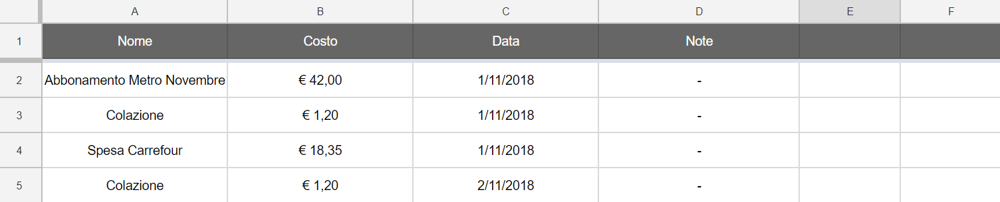
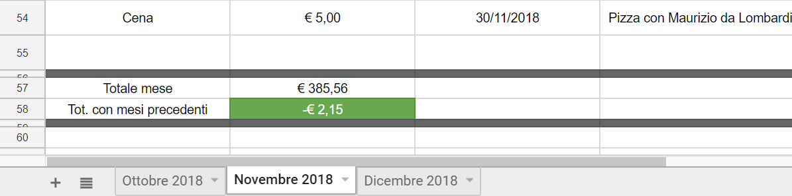

# Google Sheets Costs Script

This is a script I made to manage per-month costs on Google Drive, with expense name, cost, date and some notes. You are free to use it and edit it for your own purposes.

This script is created to auto-update the total value by using a `=SUM()` function on the costs column, with a range from its second row (see first screenshow), to the first gray (see second screenshot) in the footer. By doing this, the references will update when a new row is created and you won't have to update manually the formula.

To use it you have to create first a new Google Drive SpreadSheet document. In the toolbar go to `Tools > Script editor`. A new tab will open.
Create a new script and paste `index.js` script in it.

At the beginning of the script, some settings are available to be customized. For any further explanation, open a topic in issues. Default language is Italian. Hope you enjoy! 😊

### Screenshots

